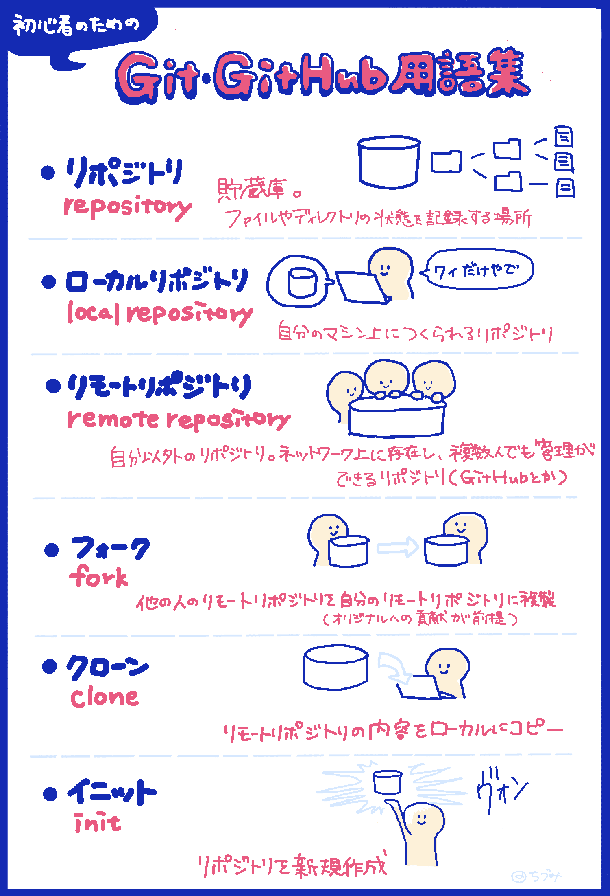
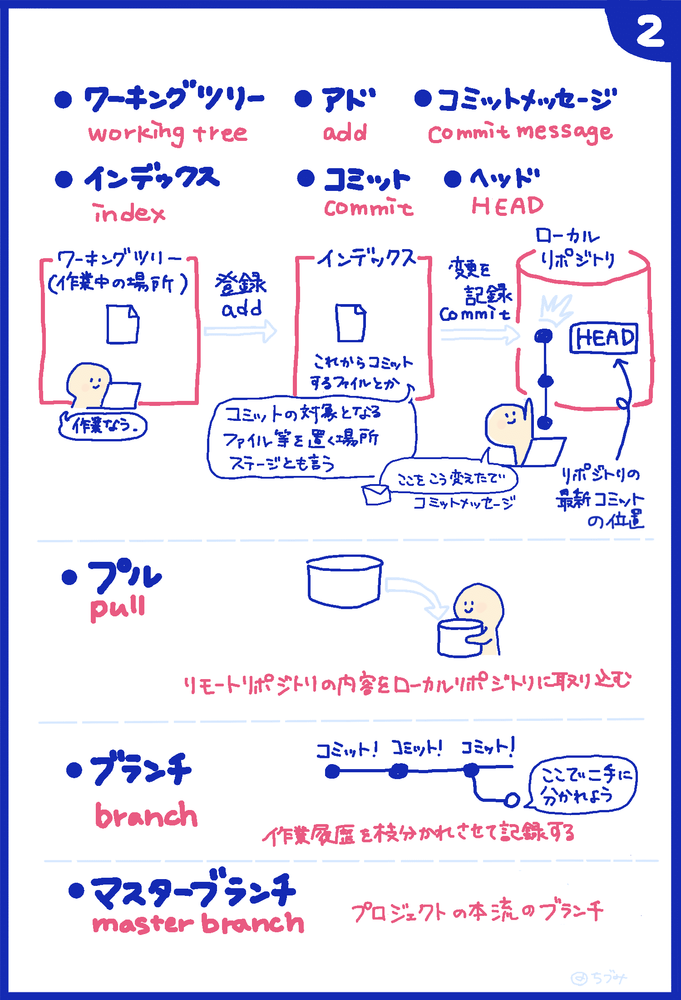
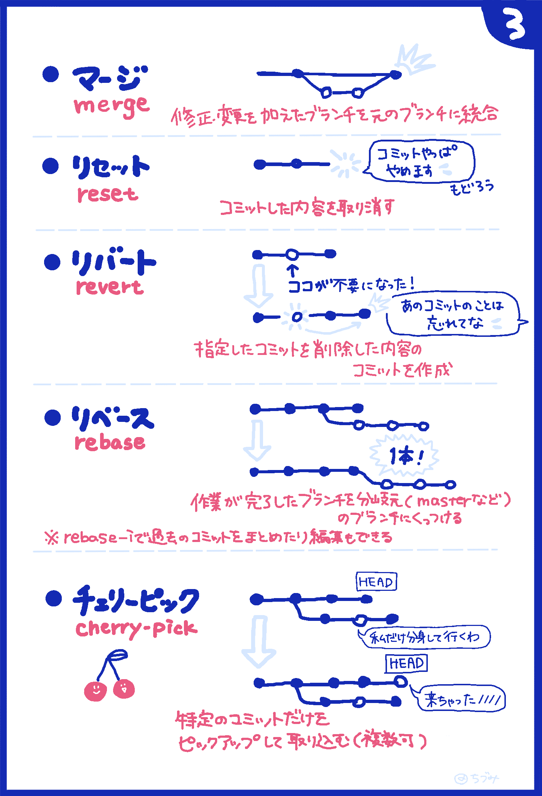
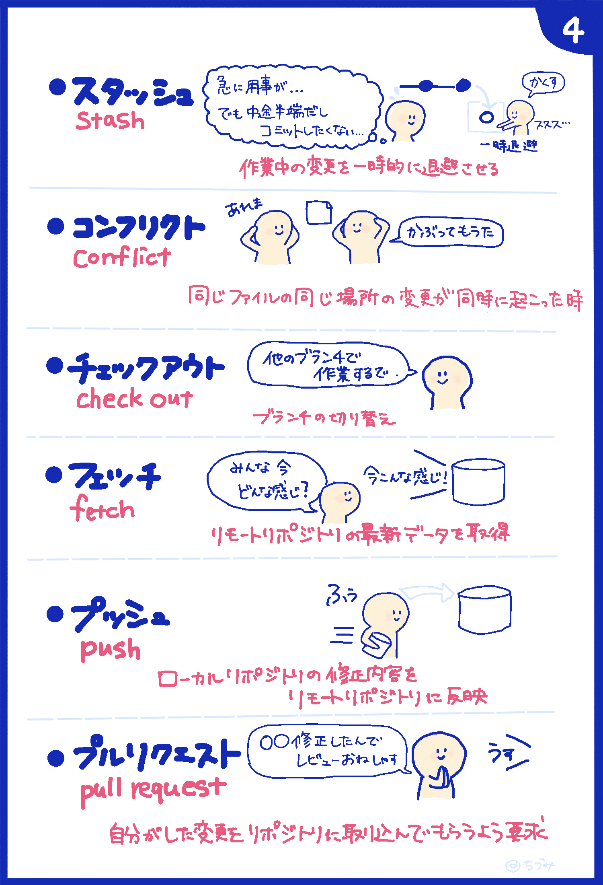

# 鹿児島.mk #24

connpass: [鹿児島.mk #24 GitとPull Requestを活用したチーム開発手法の紹介及び体験会](https://kagoshima-mk.connpass.com/event/244158/)

このイベントで使うリポジトリです。

## 準備

- マシンにGitをインストールする
- GitHubに登録する

### Windowsでのインストール方法
- [【Windows】Gitの環境構築をしよう！](https://prog-8.com/docs/git-env-win) を参考にインストールする。
- [【Git】Windows環境でGitHubにSSH接続してコミットするまでの手順](https://qiita.com/hollyhock0518/items/a3fee20951cd92c87ed9) を参考に鍵認証の設定を行う。

### Macでのインストール方法
- [Git のインストール 〜Git をMacにインストールしよう〜](https://tracpath.com/bootcamp/git-install-to-mac.html) を参考にインストールする。

GitHubに登録したら、アカウントを主催者陣に教えてください。

## 今回やること

イベントページにもある通り、Git/GitHubを使ったチーム開発を体験します。

まず「Git/GitHubってなに？どんな感じで使うの？」を簡単に説明したあと、
実際に開発を体験してもらいます。

## [GitとGitHub用語集](https://zukulog098r.com/git/)

[【イラストで覚える】初心者のためのGitとGitHub用語集](https://zukulog098r.com/git/) より引用

### 開発の流れ

1. リポジトリをclone
1. リポジトリをローカルマシンにclone
1. ローカルで修正用ブランチを切る(名前は任意)
1. 任意のフォルダを作る
1. 上で作ったフォルダ内に`./hkt100rtken/README.md`を参考にREADME.mdを作成
1. 修正をcommitして、ブランチをGitHubにpushする
1. GitHub上でPull Requestを作成する
1. レビューを依頼する
1. レビューがOKならmasterブランチにmergeする
1. GitHub上で表示がどうなっているかを確認する

